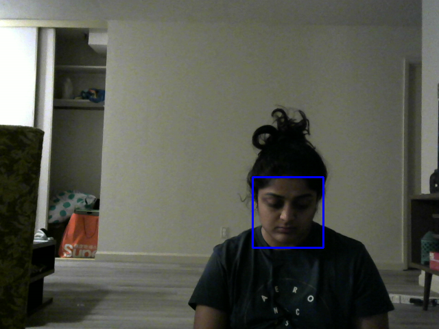

# Deep Learning in the Cloud and at the Edge Homework Repository

This is a homework repository for W251 course at UC Berkeley MIDS.

## Overall Architecture Flow:


## Order of Operations
**Local Setup**
1. Build Docker containers

Example:
```
docker build -t dhruvi04/hw3_mqtt_broker --no-cache -f Dockerfile .
docker push dhruvi04/hw3_mqtt_broker
```

2. Deploy container into Kubernetes

Example:
```
sudo systemctl start k3s
kubectl apply -f mqtt_broker/deployment.yaml
kubectl apply -f mqtt_broker/service.yaml
kubectl get service
sleep 10
kubectl get pods
```


**Remote - Cloud Setup**
1. Set up EC2 instance
```
aws ec2 create-security-group --group-name hw3 --description "hw3 host security group" --vpc-id vpc-XXXXXXXX
aws ec2 authorize-security-group-ingress --group-id YOUR_PUBLIC_GROUP_ID --protocol tcp --port 22 --cidr 0.0.0.0/0
aws ec2 run-instances --image-id ami-0bcc094591f354be2 --instance-type t2.large --security-group-ids
YOUR_PUBLIC_GROUP_ID --associate-public-ip-address --key-name YOUR_KEY_NAME
ssh -A ubuntu@YOUR_PUBLIC_EC2_NAME.compute-1.amazonaws.com
```
2. Create S3 bucket
- `w251-dhruvi`

3. Install Docker and log into Docker Hub, and made sure to change permissions
```
 sudo usermod -aG docker $USER
 newgrp docker
```
4. Install kubernetes

4. Expose mosquitto NodePort
```
 aws ec2 authorize-security-group-ingress --group-id <security group> --protocol tcp --port 1883 --cidr 0.0.0.0/0
  aws ec2 authorize-security-group-ingress --group-id <security group> --protocol tcp --port 30003 --cidr 0.0.0.0/0
```
5. Build Docker containers and deploy broker service into Kubernetes

**Debugging Commands**

1. To get into port
```
kubectl exec --stdin --tty <pod-id> -- /bin/bash
```

## Face Image Example
- **S3 bucket:** 

https://w251-dhruvi.s3.amazonaws.com/HW3/

- **Sample Image:**

https://w251-dhruvi.s3.amazonaws.com/HW3/02-04-2022-06-21-32_image.png




- **AWS S3 console screenshot:**


## MQTT
MQTT is a Client Server publish/subscribe messaging transport protocol. It is light weight, open, simple, and designed so as to be easy to implement. In MQTT, a topic refers to a UTF-8 string that the broker uses to filter messages for each connected client. For the purpose of this project, we used topic `face_detection` to  describe the face detecting sensors (USB camera and haarcascade_frontalface_default.xml). The topic is represented in both the publisher and subscriber codes. 

QoS of 0 was used in this assignment as it is not necessary to publish every face image captured as reflected in the below code snippet.